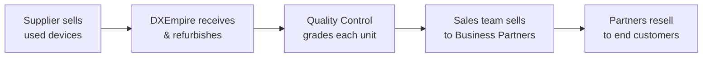
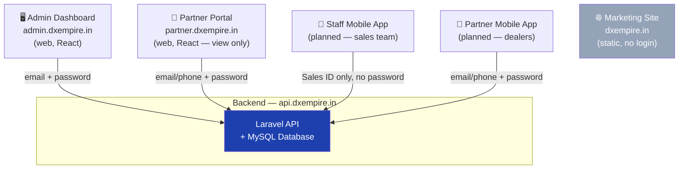
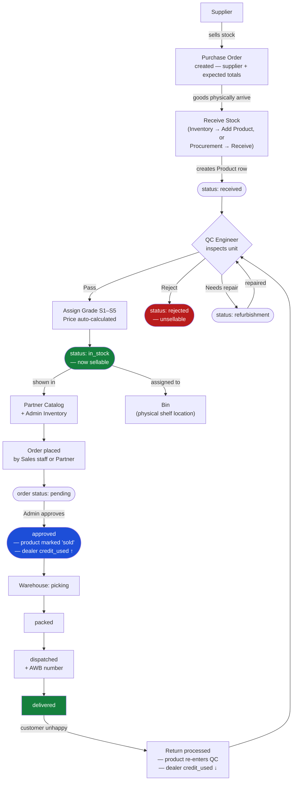
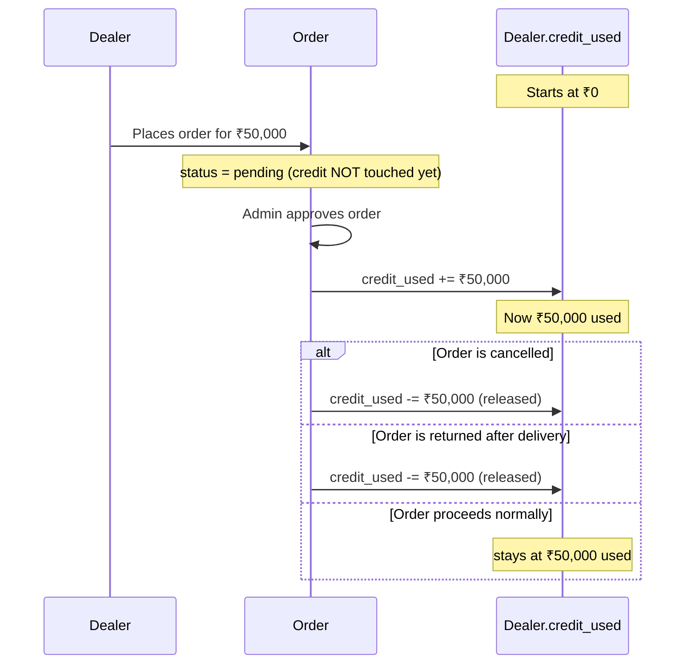
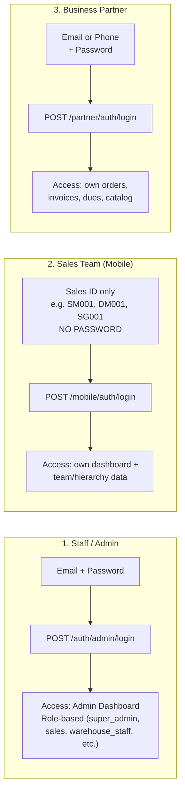

# DXEmpire — Complete System Documentation

_Last updated: 2026-07-23_

This document explains **what DXEmpire does, how every piece fits together, what every API
endpoint does, and what every menu in the admin dashboard is for** — in plain language, with
diagrams. It's written for anyone joining the project (developer, tester, or client) who needs
the full picture without digging through code.

---

## Table of Contents

1. [What DXEmpire Is](#1-what-dxempire-is)
2. [System Architecture — the 4 Apps](#2-system-architecture--the-4-apps)
3. [The Complete Product Journey (Flow Diagram)](#3-the-complete-product-journey-flow-diagram)
4. [Credit Limit Explained — "Is it a wallet?"](#4-credit-limit-explained--is-it-a-wallet)
5. [The Three Login Systems](#5-the-three-login-systems)
6. [Admin Dashboard — Menu by Menu](#6-admin-dashboard--menu-by-menu)
7. [Complete API Reference by Module](#7-complete-api-reference-by-module)
8. [User Roles — Who Can Do What](#8-user-roles--who-can-do-what)
9. [Known Limitations & Gaps](#9-known-limitations--gaps)
10. [Where Things Live (Folder Map)](#10-where-things-live-folder-map)

---

## 1. What DXEmpire Is

DXEmpire buys **used/returned electronics** (phones, laptops), **refurbishes and grades** them,
and sells them in bulk to **business partners (dealers)** through a **sales team** organized in a
hierarchy (State Manager → Area Manager → District Manager → Salesman). It's a **B2B refurbished
electronics distribution platform**, not a consumer retail store.



---

## 2. System Architecture — the 4 Apps

Everything talks to **one backend API**. There is no separate database per app — one source of
truth, four different doors into it.



| App | URL | Who uses it | Built? |
|-----|-----|-------------|--------|
| **Admin Dashboard** | admin.dxempire.in | Staff (all internal roles) | ✅ Full, live |
| **Partner Portal** | partner.dxempire.in | Business partners (dealers) | ✅ View-only, live |
| **Staff Mobile App** | (native app) | Sales hierarchy (SM/AM/DM/Salesman) | 🔨 APIs ready, app being built |
| **Partner Mobile App** | (native app) | Business partners | 🔨 APIs ready, app being built |
| **Marketing Site** | dxempire.in | Public / prospective customers | ✅ Static site, live |

---

## 3. The Complete Product Journey (Flow Diagram)

This is the single most important flow in the system — it explains where every menu and API fits.



### The 3 statuses to remember

| Layer | Status field | Values |
|-------|-------------|--------|
| **Product** | `products.status` | `received` → `qc_pending` → `in_stock` / `refurbishment` / `rejected` → `reserved` → `sold` → `returned` |
| **Order** | `orders.status` | `pending` → `approved` → `picking` → `packing`/`packed` → `dispatched` → `delivered` (or `cancelled`/`returned`) |
| **Payment** | `orders.payment_status` | `unpaid` → `partial` → `paid` (or `refunded`) |

---

## 4. Credit Limit Explained — "Is it a wallet?"

**Short answer: No — it is NOT a wallet.** A wallet is money a partner has already paid in. This
is the **opposite** — it's a **line of credit** (like a credit card limit), showing how much a
partner is **allowed to owe** DXEmpire at once for goods already delivered but not yet paid for.

```
Credit Limit   ₹3,00,000   ← the ceiling: max value of unpaid orders this partner can have
Credit Used    ₹2,06,423   ← value of currently-approved orders (whether paid or not — see note below)
Available      ₹93,577     ← Credit Limit − Credit Used = how much more they can order right now
```

### How it moves



- **Placing an order does NOT touch the credit limit** — only **approving** it does.
- **Approving** an order **increases** `credit_used` by the order's total value.
- **Cancelling** an approved order, or **returning** a delivered order, **decreases** `credit_used`
  back down (the credit is "released").
- A partner **cannot place a new order** if `credit_used + new order total > credit_limit`
  (enforced in `Dealer::canPlaceOrder()`), and they also can't order at all until their
  **KYC is verified**.

### ⚠️ Important nuance (a real gap, documented honestly)

**Recording a payment against an invoice does NOT currently reduce `credit_used`.** Today, the
credit line only frees up when an order is **cancelled** or **returned** — not when the partner
actually **pays their invoice**. In a fully correct accounts-receivable model, paying off an
invoice should also release that partner's credit. This is a **known limitation**, not an
intended design — worth fixing before this is used for real credit management at scale. Until
then, use the **Finance → Receivables** page to see who owes what in cash terms; don't rely on
`credit_used` alone as "how much this partner currently owes in unpaid invoices."

---

## 5. The Three Login Systems

DXEmpire deliberately has **three separate authentication systems** — they are not interchangeable,
and a token from one will not work on another's endpoints.



| # | Who | Login method | Endpoint | What they see |
|---|-----|--------------|----------|----------------|
| 1 | Staff (all internal roles) | Email + password | `POST /auth/admin/login` | Admin Dashboard — scoped by role |
| 2 | Sales hierarchy (State/Area/District Manager, Salesman) | **Sales ID only** (no password!) — e.g. `SM001` | `POST /mobile/auth/login` | Their own performance + their team's, nothing else |
| 3 | Business Partner (dealer) | Email or phone + password | `POST /partner/auth/login` | **Only their own** orders/invoices/dues/catalog — never another partner's data |

Why a Sales ID with no password? Field sales staff need a fast, simple login on shared/basic
phones — a memorable code (their own employee ID) is the whole credential. It is **not** used
for the admin dashboard or partner portal — those require real passwords.

---

## 6. Admin Dashboard — Menu by Menu

Every item in the left sidebar, what it's for, and which role(s) can see it.

| Menu | Purpose | Who sees it | Main APIs |
|------|---------|-------------|-----------|
| **Dashboard** | Home screen — today/week/month revenue, active orders, stock levels, pending QC/dispatch, top products/dealers, recent orders | Everyone | `GET /analytics/dashboard` |
| **Orders** | View all orders, their fulfillment status; approve/cancel; move through picking→packed→dispatched→delivered | super_admin, sales, warehouse_staff | `GET/POST /orders`, `/orders/{id}/approve`, `/picking`, `/dispatch`, `/deliver` etc. |
| **Inventory** | List every physical unit (IMEI, brand, model, grade, status, price, bin). **"Add Product"** button creates new stock. Filter by category/grade/status, export to Excel | super_admin, warehouse_staff, qc_engineer | `GET /inventory`, `POST /procurement/receive`, `GET /inventory/export` |
| **Catalog Images** | Upload real product photos (brand+model+category → 1 photo) shown to partners in the app/portal catalog | super_admin only | `GET/POST /admin/catalog-images`, `POST /admin/catalog-images/upload` |
| **QC** | Grade incoming stock (Pass with grade S1–S5 → auto in-stock + auto-priced, or Reject); send items to Refurbishment | super_admin, warehouse_staff, qc_engineer | `GET /qc/pending`, `POST /qc/grade`, `POST /qc/refurbishment` |
| **Bins** | Manage physical storage locations; move a product into a bin | super_admin, warehouse_staff | `GET /bins`, `POST /bins/move` |
| **Procurement** | Create Purchase Orders (supplier + expected totals) and Suppliers; "Receive Stock" against a PO records the real units that arrived | super_admin, warehouse_staff | `GET/POST /purchase-orders`, `GET/POST /suppliers`, `POST /purchase-orders/{id}/receive` |
| **Business Partners** | List/create dealers (business partners), approve/reject their KYC, set credit limit, view their ledger | super_admin, sales | `GET/POST /dealers`, `PUT /dealers/{id}/kyc`, `PUT /dealers/{id}/credit` |
| **Leads** | Track prospective business partners through a sales pipeline (new → contacted → quoted → negotiating → won/lost); convert a won lead into a real Business Partner | super_admin, sales | `GET/POST /leads`, `PUT /leads/{id}/stage`, `POST /leads/{id}/convert` |
| **Hierarchy** | View/manage the sales org chart (CEO → State Manager → Area Manager → District Manager → Salesman) — each has a Unique Code matching their mobile-app Sales ID | super_admin, sales | `GET/POST /sales/hierarchy`, `/hierarchy/tree`, `/hierarchy/{id}/downline` |
| **Offers** | Create discount codes/promotions (percentage or fixed, restricted to phone/laptop/all, by grade, by customer type) | super_admin, sales | `GET/POST /offers`, `POST /offers/validate` |
| **Retail Customers** | View/manage individual (B2C) customers who bought via the retail storefront (separate from B2B partners) | super_admin, sales, accounts | `GET /customers` |
| **Support Tickets** | Customer/partner support requests tied to an order; assign, track status (open/in_progress/resolved/closed), priority | super_admin, sales, accounts, warehouse_staff | `GET/POST /support/tickets` |
| **Peti to Peti** | Bulk stock transfers between warehouse locations or to a specific dealer (batches of graded units) | super_admin, warehouse_staff | `GET/POST /peti-transfers`, `/approve`, `/complete` |
| **Finance → Invoices** | GST invoices generated per delivered order; download PDF; record a payment against one | super_admin, accounts | `GET /finance/invoices`, `POST /finance/invoices/{id}/payment` |
| **Finance → Expenses** | Log business operating expenses by category | super_admin, accounts | `GET/POST /finance/expenses` |
| **Finance → P & L** | Profit & Loss report — revenue vs expenses, monthly or quarterly, for a chosen year | super_admin, accounts | `GET /finance/profit-loss?period=&year=` |
| **Finance → GST** | Monthly GST filing report — invoice-wise CGST/SGST breakup; export as CSV | super_admin, accounts | `GET /finance/gst-summary?month=`, `/gst-export` |
| **Finance → Receivables** | Which dealers currently owe money (credit_used > 0), sorted by amount, with utilisation % | super_admin, accounts | `GET /finance/receivables` |
| **HR → Employees** | Staff directory — name, code, department, designation, salary, employment type | super_admin, hr_manager | `GET/POST /hr/employees` |
| **HR → Attendance** | Daily attendance per employee (present/absent/half-day/leave) | super_admin, hr_manager | `GET /hr/attendance`, `POST /hr/attendance/bulk` |
| **HR → Payroll** | Monthly payroll runs — compute net salary per employee, mark paid, generate/download payslips | super_admin, hr_manager | `GET/POST /hr/payroll`, `/hr/payroll/{id}/process` |
| **Analytics** | Deeper reports — revenue trends, sales performance, inventory breakdown, stock movement history, partner performance, demand forecast | super_admin, sales, accounts | `GET /analytics/revenue`, `/sales`, `/inventory`, `/forecast` |
| **Users** | Manage internal staff accounts and their roles | super_admin only | `GET/POST /admin/users`, `PUT /admin/users/{id}/role` |
| **Audit Logs** | Who did what, when — a system-wide activity trail | super_admin only | `GET /admin/audit-logs` |
| **Settings** | Company details, GST rate, default thresholds, feature toggles | super_admin only | `GET/PUT /admin/settings` |

---

## 7. Complete API Reference by Module

All endpoints are under `https://api.dxempire.in/api/v1`. Full request/response **samples** for
the mobile-facing endpoints (Staff app, Partner app, Warehouse app) live in **`API_REFERENCE.md`**
— this section is the **map of everything that exists**, admin-side included.

### 7.1 Auth (Staff/Admin)
| Method | Endpoint | Purpose |
|--------|----------|---------|
| POST | `/auth/admin/login` | Email + password login for all staff roles |
| GET | `/auth/me` | Current logged-in user's profile |
| POST | `/auth/refresh` | Refresh the auth token |
| POST | `/auth/logout` | Revoke the current token |
| POST | `/auth/send-otp` / `/auth/verify-otp` | Phone OTP login (used by some flows) |

### 7.2 Admin — Users, Settings, Audit
| Method | Endpoint | Purpose |
|--------|----------|---------|
| GET | `/admin/users` | List staff accounts |
| POST | `/admin/users` | Create a staff account |
| PUT | `/admin/users/{id}` | Update a staff account |
| PUT | `/admin/users/{id}/role` | Change a staff member's role |
| POST | `/admin/users/{id}/deactivate` / `/activate` | Enable/disable login |
| GET | `/admin/roles` | List available roles |
| GET/POST/DELETE | `/admin/catalog-images` (+`/upload`) | Manage partner-catalog product photos |
| GET | `/admin/audit-logs` | System activity trail |
| GET/PUT | `/admin/settings` | Company-wide configuration |

### 7.3 Procurement (Suppliers, Purchase Orders, Receiving)
| Method | Endpoint | Purpose |
|--------|----------|---------|
| GET/POST | `/suppliers` | List / add a supplier |
| PUT/DELETE | `/suppliers/{id}` | Edit / remove a supplier |
| GET/POST | `/purchase-orders` | List / create a PO (supplier + expected totals) |
| PUT | `/purchase-orders/{id}` | Update PO status |
| POST | `/purchase-orders/{id}/receive` | **Receive stock against a PO** — creates real Product rows |
| POST | `/procurement/receive` | **Receive stock without a PO** — quick add (used by Inventory → Add Product) |
| GET | `/procurement/history` | Everything ever received |

### 7.4 Inventory & Bins
| Method | Endpoint | Purpose |
|--------|----------|---------|
| GET | `/inventory` | Paginated product list with filters (category/grade/status/brand/search) |
| GET | `/inventory/availability` | Stock counts by category+grade (dashboard widget) |
| GET | `/inventory/imei/{imei}` | Look up one unit by IMEI (scan-friendly) |
| GET | `/inventory/{id}` | Full detail of one product |
| GET | `/inventory/export` | Download inventory as Excel |
| GET/POST | `/bins` | List / create storage bins |
| POST | `/bins/move` | Move a product into a bin |
| GET | `/bins/{id}/products` | What's currently in a bin |

### 7.5 Quality Control
| Method | Endpoint | Purpose |
|--------|----------|---------|
| GET | `/qc/pending` | Units awaiting inspection |
| POST | `/qc/grade` | Record outcome: `pass` (assigns grade, auto-prices, → in_stock), `reject` (→ rejected) |
| GET | `/qc/records` | Full grading history |
| GET | `/qc/stats` | Pending/graded-today/refurbishment/rejected counts |
| GET/POST | `/qc/refurbishment` | View / send a unit to the repair queue |
| PUT | `/qc/refurbishment/{id}` | Mark repair complete (sends back to QC) |

### 7.6 Orders & Fulfillment
| Method | Endpoint | Purpose |
|--------|----------|---------|
| GET | `/orders` | List orders (filterable) |
| GET | `/orders/{id}` | Order detail with line items |
| POST | `/orders` | Create a new order (sales staff or partner) |
| POST | `/orders/{id}/approve` | **Admin only** — locks stock as sold, increases dealer credit_used |
| POST | `/orders/{id}/cancel` | **Admin only** — releases stock and credit |
| POST | `/orders/{id}/picking` → `/packing-complete` → `/dispatch` → `/deliver` | Warehouse fulfillment lifecycle, in strict order |
| POST | `/orders/{id}/return` | Process a return — product re-enters QC, credit released |
| GET | `/orders/{id}/payments` | Payments recorded against this order |
| GET | `/orders/{id}/invoice/download` | Download the GST invoice PDF |

### 7.7 Finance
| Method | Endpoint | Purpose |
|--------|----------|---------|
| GET | `/finance/invoices` | List generated invoices |
| POST | `/finance/invoices/orders/{orderId}/generate` | Create a GST invoice for a delivered/approved order |
| POST | `/finance/invoices/{id}/payment` | Record a payment against an invoice |
| GET/POST | `/finance/expenses` | List / log operating expenses |
| GET | `/finance/profit-loss?period=monthly\|quarterly&year=` | Revenue vs expenses over time |
| GET | `/finance/gst-summary?month=YYYY-MM` | Invoice-wise CGST/SGST breakup for filing |
| GET | `/finance/gst-export?month=YYYY-MM` | Same, as a downloadable CSV |
| GET | `/finance/receivables` | Dealers with outstanding credit_used |
| GET | `/finance/dealers/{id}/ledger` | Full transaction history for one dealer |
| GET/POST | `/finance/vendor-payments` | Payments made **to** suppliers |

### 7.8 HR
| Method | Endpoint | Purpose |
|--------|----------|---------|
| GET/POST | `/hr/employees` | Staff directory |
| GET | `/hr/attendance` | Attendance records |
| POST | `/hr/attendance/bulk` | Mark attendance for multiple employees at once |
| POST | `/hr/attendance/check-in` / `/check-out` | Self-service clock in/out |
| GET/POST | `/hr/payroll` | Payroll runs |
| POST | `/hr/payroll/{id}/process` | Compute net salaries for a run |
| POST | `/hr/payroll/{id}/mark-paid` | Mark a payroll run as disbursed |
| GET | `/hr/payroll/{id}/slips/{itemId}` | Download one employee's payslip PDF |

### 7.9 CRM — Leads, Business Partners, Support
| Method | Endpoint | Purpose |
|--------|----------|---------|
| GET/POST | `/leads` | Sales pipeline for prospective partners |
| PUT | `/leads/{id}/stage` | Move a lead through the pipeline |
| POST | `/leads/{id}/convert` | Turn a won lead into a real Business Partner |
| GET/POST | `/dealers` | List / create Business Partners |
| PUT | `/dealers/{id}/kyc` | Approve/reject a partner's KYC |
| PUT | `/dealers/{id}/credit` | Set a partner's credit limit |
| GET | `/dealers/{id}/ledger` | Transaction history for one partner |
| GET/POST | `/support/tickets` | Support requests |

### 7.10 Sales Hierarchy & Offers
| Method | Endpoint | Purpose |
|--------|----------|---------|
| GET/POST | `/sales/hierarchy` | Org chart nodes (create with `parent_unique_code`, not raw `parent_id`) |
| GET | `/sales/hierarchy/tree` | Full nested org tree |
| GET | `/sales/hierarchy/{id}/downline` | Everyone below this person + their combined performance |
| GET/POST | `/offers` | Discount codes |
| POST | `/offers/validate` | Check if a code is usable for a given order total |

### 7.11 Peti to Peti
| Method | Endpoint | Purpose |
|--------|----------|---------|
| GET/POST | `/peti-transfers` | Bulk stock transfer batches |
| POST | `/peti-transfers/{id}/approve` / `/complete` / `/cancel` | Move a transfer through its lifecycle |

### 7.12 Analytics
| Method | Endpoint | Purpose |
|--------|----------|---------|
| GET | `/analytics/dashboard` | Main dashboard numbers |
| GET | `/analytics/revenue` | Revenue over time, by channel |
| GET | `/analytics/sales` | Sales performance |
| GET | `/analytics/inventory` | Stock breakdown |
| GET | `/analytics/stock-movements` | Bin/status change history |
| GET | `/analytics/partners` | Partner performance ranking |
| GET | `/analytics/forecast` | Demand forecast |

### 7.13 Mobile App (Sales Hierarchy Staff)
See **`API_REFERENCE.md` Part 1** for full request/response samples.
`POST /mobile/auth/login` (Sales ID) · `GET /mobile/dashboard` (role-specific) ·
`GET /mobile/hierarchy/subordinates` / `/tree` / `/team-stats` / `/colleagues`

### 7.14 Partner Portal / App
See **`API_REFERENCE.md` Part 2** for full request/response samples.
`POST /partner/auth/login` · `GET /partner/dashboard` · `GET/POST /partner/orders` ·
`GET /partner/invoices` · `GET /partner/dues` · `GET /partner/catalog(/brands|/grades)`

### 7.15 Retail (B2C) — separate consumer-facing storefront
`POST /retail/auth/send-otp`+`/verify-otp` · `GET /retail/catalog` · `GET/POST /retail/cart` ·
`GET/POST /retail/orders` — this is a **different customer type** (`Customer` model) from Business
Partners (`Dealer` model); used for direct-to-consumer sales, kept fully separate from the B2B flow.

---

## 8. User Roles — Who Can Do What

| Role | Can access |
|------|-----------|
| `super_admin` | Everything |
| `sales` | Orders (view/create), Leads, Business Partners (view), Hierarchy, Offers, Analytics, Support Tickets |
| `warehouse_staff` | Inventory, Bins, Procurement, QC (view/grade), Order fulfillment (picking→deliver), Peti Transfers |
| `qc_engineer` | Inventory (view), QC (grade) |
| `accounts` | Finance (all), Analytics, Retail Customers, Support Tickets |
| `hr_manager` | HR (Employees, Attendance, Payroll) |
| `b2b_partner` | **Not** the admin dashboard — Partner Portal / Partner app only, scoped to their own data |
| `logistics` | Dashboard, Logistics endpoints |

---

## 9. Known Limitations & Gaps

Documented honestly so nothing is a surprise later:

1. **Credit limit isn't released by payment** — see [Section 4](#4-credit-limit-explained--is-it-a-wallet). Only cancel/return frees credit today.
2. **Staff mobile dashboard stats are placeholders** — order/lead counts and revenue on the mobile dashboard are hardcoded `0`/`[]`; not yet wired to real aggregation.
3. **Catalog images** — the upload feature works, but most products still show demo placeholder photos until someone uploads real ones via Inventory → Catalog Images.
4. **Push notifications (Expo)** — functional, but only fire on order-approved and order-dispatched events; picking/packed/delivered don't push yet. `EXPO_ACCESS_TOKEN` may not be set in production (optional but recommended by Expo).
5. **Order-lifecycle notifications are partial** — same as above, only two of the six fulfillment steps notify.
6. **Accessories category removed** — as of 2026-07-23 the catalog only supports `phone` and `laptop`; `accessory` is no longer a valid category anywhere in the system.

---

## 10. Where Things Live (Folder Map)

```
dxempire/
├── dxempire-backend/     ← Laravel API (all business logic + database)
│   ├── app/Http/Controllers/   ← one folder per module (Orders, Finance, HR, QC, ...)
│   ├── app/Models/              ← Product, Order, Dealer, Employee, etc.
│   ├── app/Services/             ← OrderService (credit/stock logic), GradePricingService, ...
│   ├── database/migrations/      ← every schema change, in order
│   └── database/seeders/          ← demo data generators
├── web-dashboards/        ← Admin Dashboard (React) — admin.dxempire.in
│   └── src/pages/                ← one folder per sidebar section
├── partner-portal/         ← Partner Portal (plain HTML/JS) — partner.dxempire.in
├── API_REFERENCE.md        ← Full request/response docs for the 3 mobile-facing app APIs
└── SYSTEM_DOCUMENTATION.md ← this file
```

---

_This document reflects the system as of 2026-07-23. For exact request/response bodies for the
Staff, Partner, and Warehouse mobile APIs, see `API_REFERENCE.md` in the project root._
